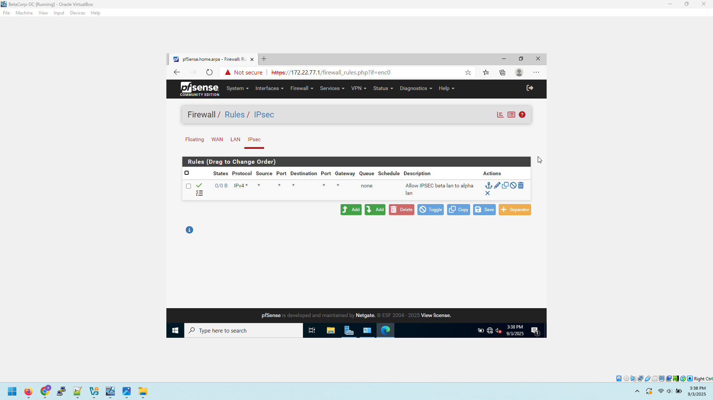

# pfSense-Site-to-Site-Routing
This project simulates a site-to-site routing environment between two organizations, **AlphaCorp** and **BetaCorp**, using **pfSense firewalls** in VirtualBox. 

The goal of this project is to demonstrate:
- Interface configuration on pfSense firewalls
- Static routing between two sites
- Firewall rule management
- End-to-end connectivity testing between LAN clients

## Topology

### Details:
- **AlphaCorp LAN**: `192.168.1.0/24`  
  - Client: `192.168.1.5` (Gateway: `192.168.1.1`)  
  - pfSense WAN: `10.10.10.4`  
  - pfSense LAN: `192.168.1.1`

- **BetaCorp LAN**: `172.22.77.0/24`  
  - Client: `172.22.77.5` (Gateway: `172.22.77.1`)  
  - pfSense WAN: `10.10.10.5`  
  - pfSense LAN: `172.22.77.1`

- **ISP Network (Internal Network in VirtualBox)**: `10.10.10.0/24`  

## ⚙️ Setup Steps
1. **VirtualBox Networking**
   - Create an *Internal Network* named `inet`
   - Attach pfSense WAN interfaces to `inet`
   - Attach pfSense LAN interfaces to separate Host-Only networks (to simulate AlphaCorp and BetaCorp LANs)

2. **pfSense Configuration**
   - Assign static WAN IPs:
     - AlphaCorp: `10.10.10.4/24`
     - BetaCorp: `10.10.10.5/24`
   - Assign LAN IPs:
     - AlphaCorp: `192.168.1.1/24`
     - BetaCorp: `172.22.77.1/24`
   - Disable **Block private networks** and **Block bogon networks** on WAN

3. **Static Routes**
   - On AlphaCorp pfSense:  
     Route `172.22.77.0/24` via `10.10.10.5`
   - On BetaCorp pfSense:  
     Route `192.168.1.0/24` via `10.10.10.4`

4. **Firewall Rules**
   - On both WANs: Allow ICMP and any-to-any traffic for testing
   - On both LANs: Allow LAN to any

5. **Connectivity Testing**
   - From AlphaCorp client (`192.168.1.5`), ping BetaCorp client (`172.22.77.5`)
   - From BetaCorp client (`172.22.77.5`), ping AlphaCorp client (`192.168.1.5`)

## 📸 Screenshots
1. **pfSense WAN interface configuration**

3. **pfSense LAN interface configuration**

 
4. **Firewall Rules (WAN + LAN)**

5. **Diagnostics → Ping results**

7. **ARP table** (showing learned MACs across WAN)

## ✅ Results
- Both AlphaCorp and BetaCorp LANs can communicate across the pfSense WAN links.  
- Firewall rules successfully control traffic between sites.  
- Demonstrates routing, firewalling, and troubleshooting skills using pfSense.  

---
